# 3D Scene Renderer

A cross-platform 3D Scene Editor and Renderer written in C++ with OpenGL. Originally written for a Computer Graphics course, it has since been added to.

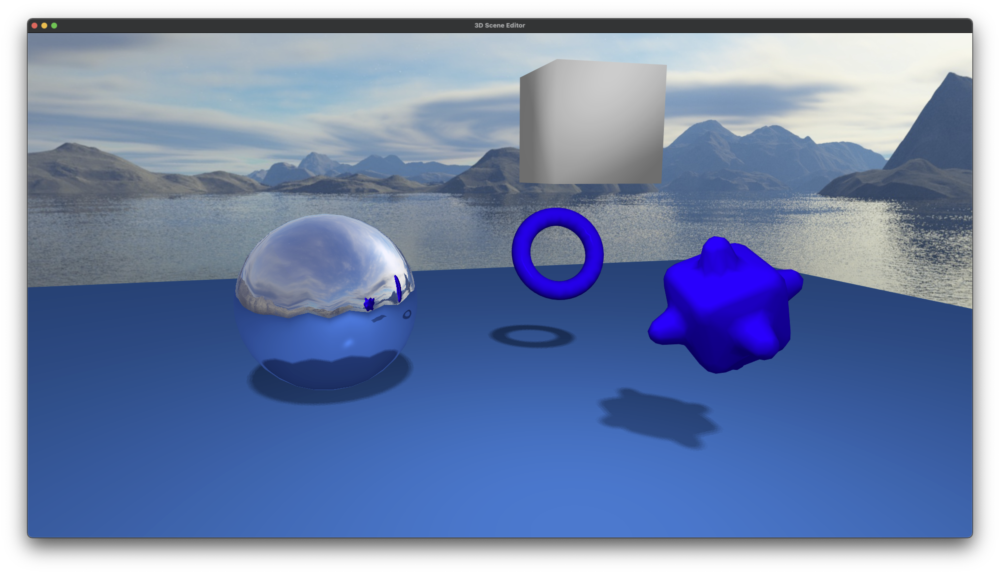

## Features

* Load triangulated 3D models from .off files
* Spawn models in a realtime 3D scene
* View the models
  * Two cameras are available
    * One that moves along the x, y, z axes and always points to the origin of world space
    * A trackball camera that moves along a sphere and always points to the origin of world space
* Transform the models
  * Translate
  * Rotate
  * Scale
* Shade the models
  * Flat shading
  * Phong shading
* Render Static and Dynamic Reflections and Refractions with Cube Mapped Environment Mapping
* Render shadows with Shadow Mapping
* Shade models with Multiple Lights
  * Directional lights
  * Point lights
* Draw debug info
  * Mesh wireframes
  * Mesh normals
  * Depth map texture used for shadow mapping
* Hot-reload shaders
  * Watched shader files are polled from another thread and reloaded automatically after saving

## Installation

This project uses gitmodules for dependency management. After cloning the repo, run `git submodule update --init --recursive` to download the necessary dependencies.

This project uses CMake for building. A brief getting started guide for creating a build with CMake follows:

1. Make a new directory for storing the build
2. `cd` into the directory
3. Run `cmake ..`
4. Run `make`
5. Finally, run the `3DSceneEditor_bin` executable

Refer to `CMakeLists.txt` for the build configuration and necessary dependencies.

## Infrastructure Notes

* The `Context` class holds `MouseState`, `Environment` (which contains the Cube Map, Lights, Camera) and `MeshEntityList` (all of the transformable mesh objects). To further generalize the renderer to other applications beyond the assignment, I intend to move the `MeshEntityList` into the `Environment`, which would then be renamed scene.
* The `lib` directory contains the general editor source code, while `src` adds specific functionality such as a `Context` class descendant to fulfill the assignment. The intention is to separate concerns and make the library extensible.

## Post Assignment-Submission Additions

### Post-Processing

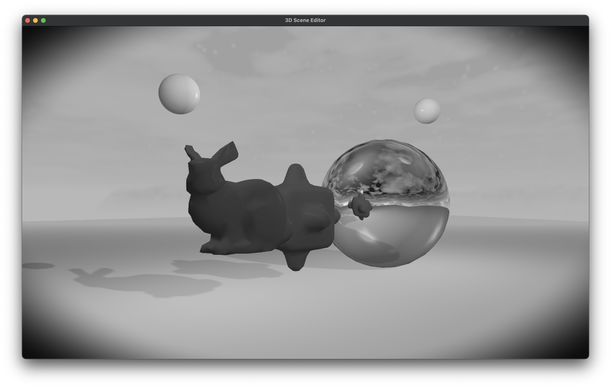

Notes:

`shaders/offscreen_vert.glsl` creates a fullscreen triangle without an additional vertex buffer and `shaders/offscreen_frag.glsl` applies the fragment post processing.

### Selected Mesh Outline Effect

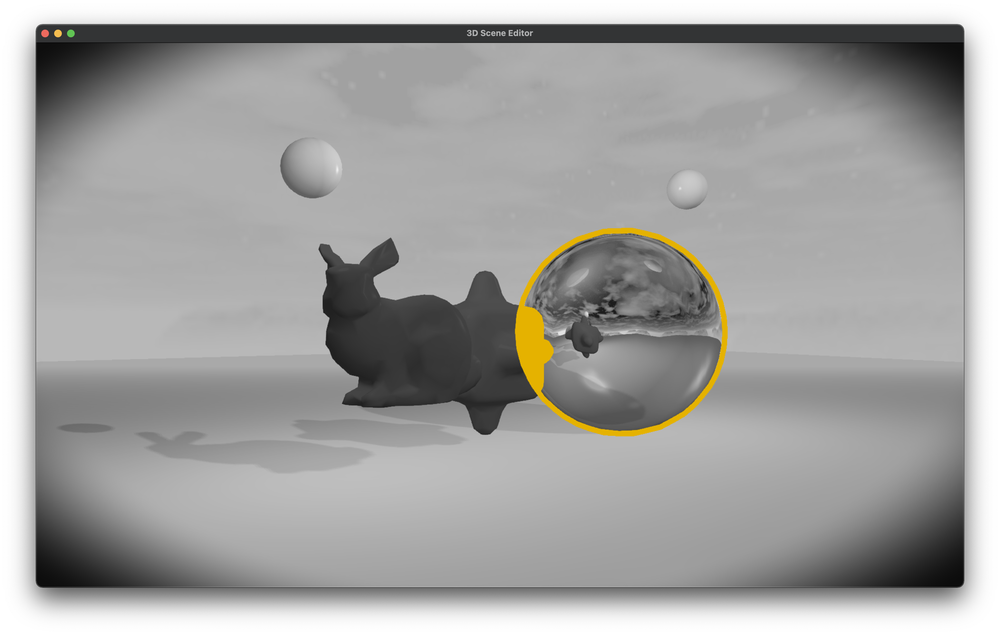

Notes:

Selecting a mesh will display an outline around it and will draw its shape irrespective of occlusion.

### Anti-Aliasing

* MSAA
  * Toggle with key `.`
* FXAA
  * Toggle with key `/`

### Fixed Render Resolution

A fixed render framebuffer resolution is set during initialization (1080p in the example src). The render framebuffer attachments are blitted to render to the window buffer.

### Point Lights

* Movable & deletable point lights
  * Same controls as with other meshes (point lights are represented with sphere meshes)
* Point light Insertion
  * Insert a point light with key `8`

### Other

### Grid

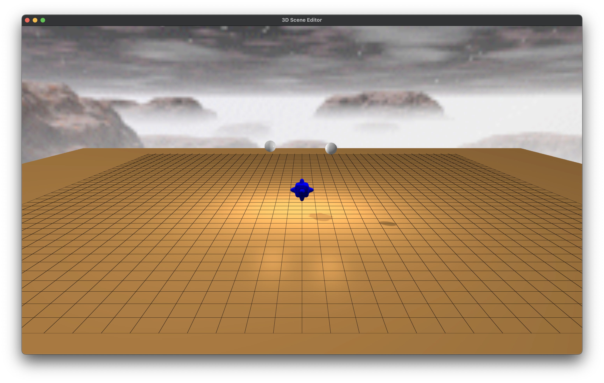

Directions:

Toggle with key `,`

## Assignment 4

Since Assignment 4 builds on Assignment 3, the same code base was used and the Assignment 3 README was added to accordingly. The description of Assignment 3 is below Assignment 4 in the README and explains foundational functionality.

Note that the default scene (that the program starts with) has one directional light that circles the scene and casts shadows (stop its movement with `u`), and one point light represented by the white sphere that does not cast shadows. Currently there is no way to add additional lights at runtime. Also note that dynamic reflections are enabled on all objects by default and can be switched off for a selected object with key `z`.

### 1.1: Shadow Mapping

A directional light circling the scene and casting shadows:

Directions:

* The movement of the directional light can be paused and un-paused by pressing `u`.
* Set the direction of the directional light with key `v` (point it in the direction of the camera).

#### Debugging Shadows With Red Color

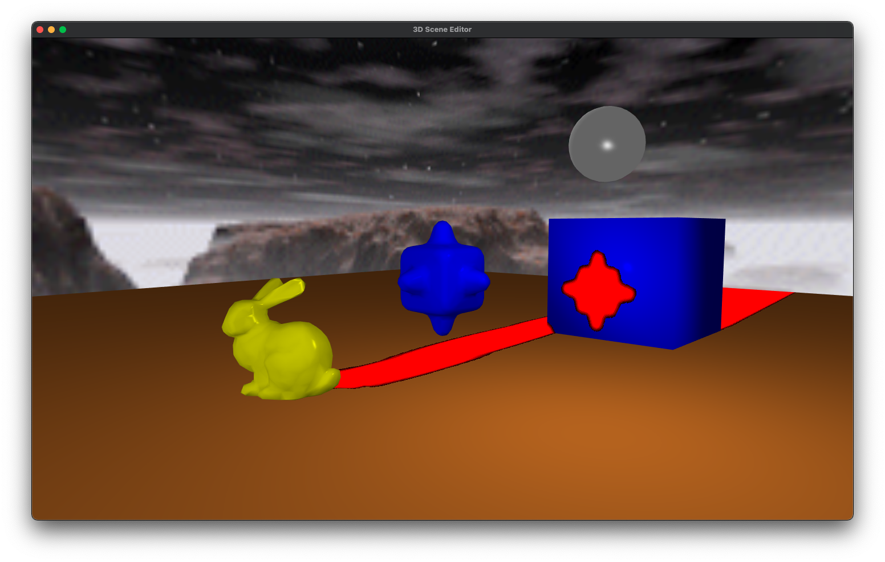

Directions:

* Show debug red shadows with key `n`.

#### Debug View of the Depth Map Texture

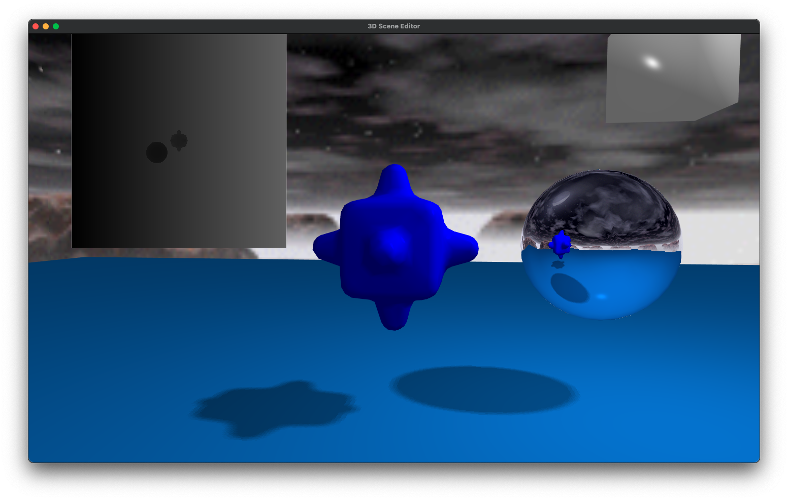

Directions:

* Activate debug view of the depth map texture with key `b`.

### 1.2: Environment Mapping

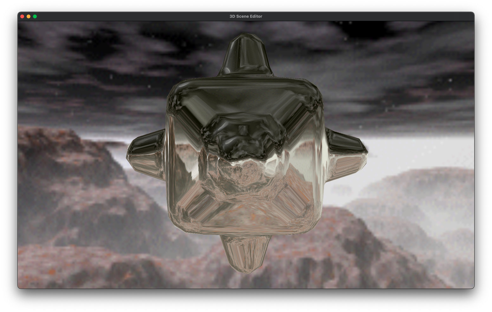
#### Static Reflections

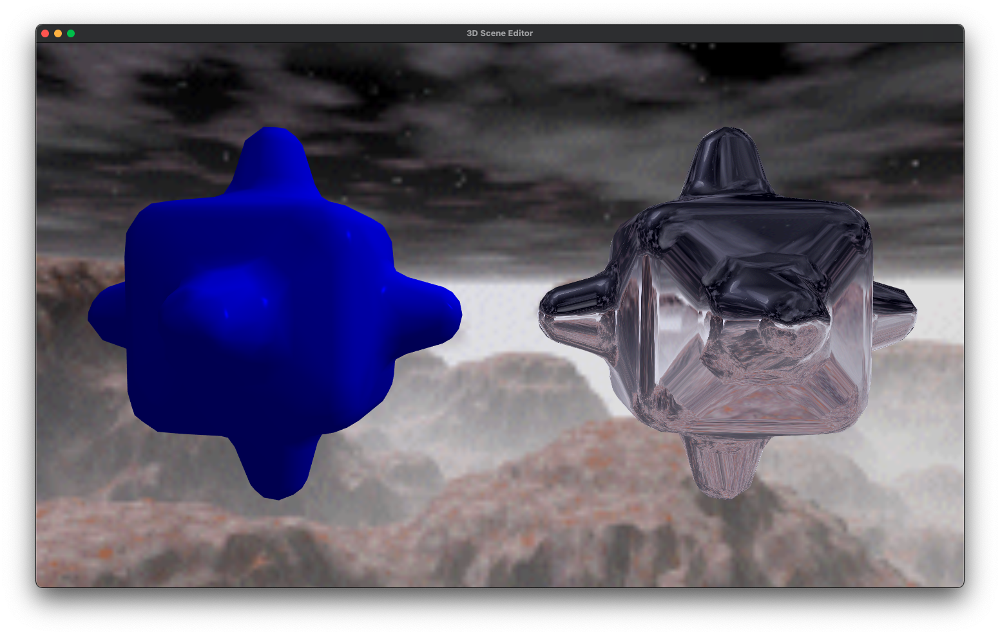

Multiple Objects:

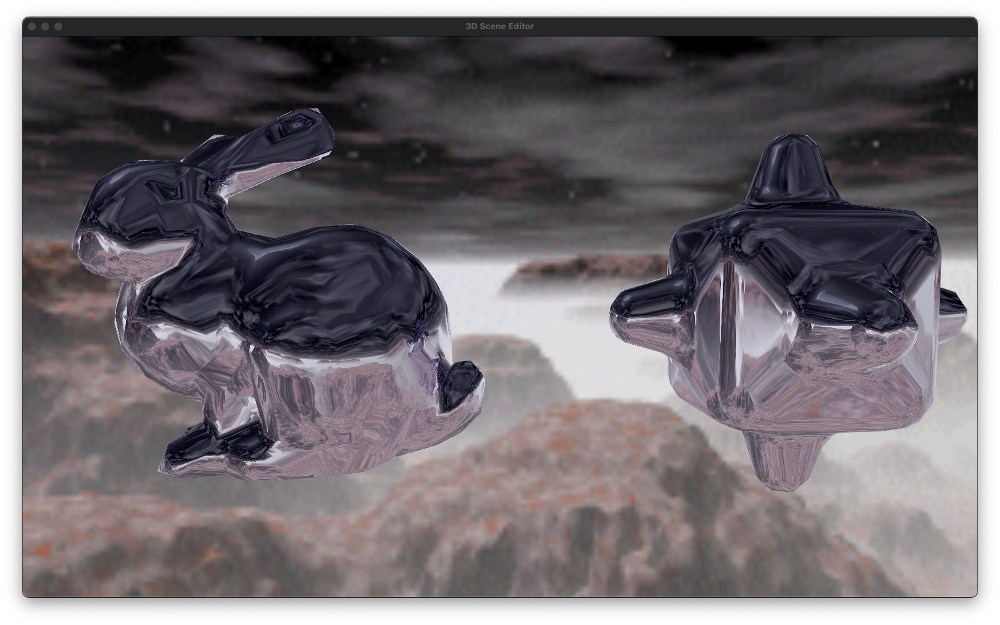

Directions:

* There are two available cube map textures. Key `i` switches between them. Note that the day time sky texture is much higher resolution and will impact system performance more than the night time sky texture.

#### Implementation Notes

* `stb_image` is an external dependency for loading the cube map's png files from disk.
* The color of the reflective surface is slightly tinted with blue or yellow to indicate selected objects in keeping with the rest of the program. Giving the objects a pure chrome finish would require a small modification to `shaders/reflect_frag.glsl` to avoid mixing in the tint.

### Optional Tasks

### 1.4 Refraction

### 1.5 Dynamic Cube Map Textures

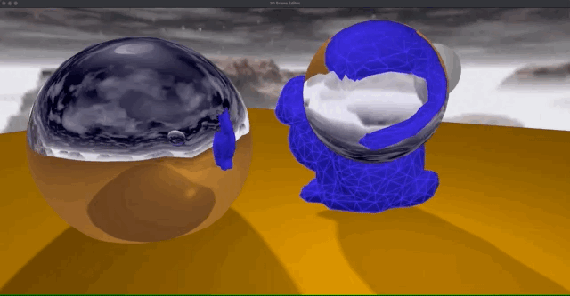

Directions:

* Disable dynamic environment mapping with key `z`.

#### Notes

Note that running the above scene on my MacBook Pro with an integrated Intel Iris Plus Graphics 655 1536 MB was quite slow. A similar scene running on an AMD RX5700 experienced no FPS drops. The reason for the slowdown is that dynamic environment mapping necessitates rendering the entire scene 6 times per reflective / refractive object.

Dynamic reflections and refractions support all rendering modes including debug features (refer to the wireframe in the image) with the exception of recursive dynamic reflections. Rendering a dynamically reflective object in another dynamically reflective object will cause it to be rendered with static reflections in the dynamic reflection.

## Assignment 3

### 1.1: Scene Editor

Adding and removing objects to the scene:

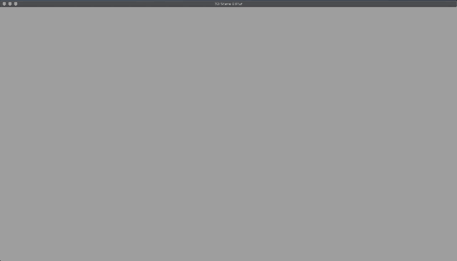

Directions:

* Key `1` inserts a unit cube at the origin with unit scale
* Key `2` inserts a bumpy cube at the origin with unit scale
* Key `3` inserts a bunny at the origin with unit scale

### 1.2: Model Control

#### Model Transformations

Directions:

* Clicking on an model with the mouse selects it. The color changes to the inverse of the model's color to indicate that it is selected.
  * Mouse picking currently checks each triangle in each mesh for collision and isn't optimized with any spatial data structures or bounding boxes.
* It is possible to transform the selected model as such (all transformations are relative to the view direction):
  * Translate
    * Key `a` translates the model left, or in the -x direction
    * Key `d` translates the model right, or in the +x direction
    * Key `w` translates the model up, or in the +y direction
    * Key `s` translates the model down, or in the -y direction
    * Key `-` translates the model towards the camera, or in the +z direction
    * Key `=` translates the model away from the camera, or in the -z direction
  * Rotate
    * Key `t` rotates the model along the x axis up
    * Key `y` rotates the model along the x axis down
    * Key `f` rotates the model along the y axis left
    * Key `g` rotates the model along the y axis right
    * Key `h` rotates the model along the z axis left
    * Key `j` rotates the model along the z axis right
  * Scale
    * Key `k` uniformly scales the model up
    * Key `l` uniformly scales the model down

#### Draw and Shading Modes ("Render Setting")

Directions:

* Cycle through the following available drawing modes with key `m`:
  * Shading only
  * Shading and Wireframe
  * Wireframe only
  * Shading and normals
* Cycle through the following available shading modes with key `p` (be sure to be in a draw mode that supports shading):
  * Phong Shading (technically Blinn-Phong)
  * Flat Shading

### 1.3: Camera Control

#### Free Camera

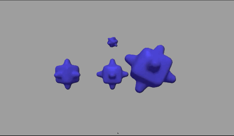

Directions:

* Pan along the x and y axes in world space by clicking and dragging the mouse in the relevant direction
* Move along the z axis in world space by scrolling with the mouse wheel
* Switch to the orthographic projection mode with key `c`

##### Orthographic Projection

Directions:

* The other features work identically in the orthographic projection mode

##### Aspect Ratio

* The aspect ratio is preserved such that the model's scale is not deformed if the window is resized
* Changing the window size preserves all functionality

### 1.5: Trackball Camera

Directions:

* Switch to the Trackball Camera by pressing key `c`.
* The mouse controls are identical to the Free Camera except now the camera moves along a sphere.

Note: Orthographic projection for the trackball camera has an additional zoom feature using the scroll wheel that just scales the view.

# Credits

* Much of the project was built with [LearnOpenGL](https://learnopengl.com/) as reference.
* Other sources credited where applicable in source code.